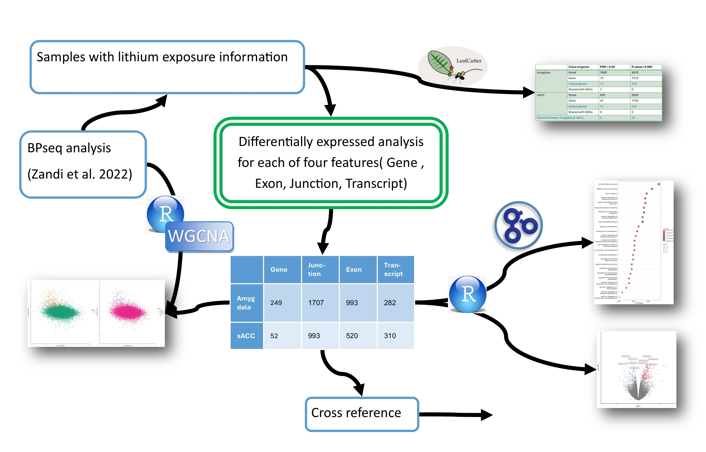

# The Neurobiological Impact of Lithium in Bipolar Disorder

## Introduction:
Lithium remains the definitive gold-standard maintenance therapy for Bipolar Disorder (BD), demonstrating unparalleled efficacy across different stages of the disorder by preventing recurrent mood episodes and significantly reducing suicide risk [[1 , 2](#references)]. However, its exact mechanism of action on the human brain remains an active area of neuroscientific inquiry.
Comparing BD patients with lithium exposure against non-exposed BD patients is clinically and scientifically crucial for several reasons:

### 1. Isolating Medication Effects from Disease Pathology

Bipolar disorder is fundamentally characterized by progressive neuroanatomical changes, including structural brain abnormalities and progressive gray matter volume loss in areas key to executive control and emotion regulation [[2 , 3](#references)]. By constructing a comparative cohort (exposed vs. non-exposed), researchers can effectively differentiate between:

- The natural progression of the illness (neuroprogression and pathological atrophy).

- The structural modifications directly induced by treatment (pharmacological intervention).
### 2. Validating Neuroprotective and Neurotrophic Hypotheses

A growing body of preclinical and in vivo translational data suggests that lithium acts as a potent neuroprotective agent rather than a mere symptom suppressor [[3 , 5](#references)]. This comparative framework allows for the empirical evaluation of several core downstream cellular hypotheses:

| Biological Mechanism | Hypothesized Impact of Lithium | Comparison Expectation (Exposed vs. Non-Exposed) |
| :--- | :--- | :--- |
| **Neurogenesis & Plasticity** | Upregulates Brain-Derived Neurotrophic Factor (BDNF) and anti-apoptotic proteins like Bcl-2 [[3 , 5](#references)] | **Exposed patients** exhibit greater gray matter volumes in critical emotion processing networks, including the hippocampus, amygdala, and anterior cingulate cortex [[1 , 6](#references)]|
| **Enzyme Inhibition** | Competitively inhibits Glycogen Synthase Kinase-3 (**$\text{GSK-3}\beta$**) and blocks NMDA receptor-mediated calcium influx [[4 , 8](#references)] | **Exposed patients** are expected to show reduced neuroinflammation, normalized cellular microstructural organization, and preserved prefrontal neurite density [[4 , 7](#references)]|
| **Neurotransmission Modulation** | Stabilizes neurotransmission by downregulating excitatory glutamate and promoting inhibitory GABA levels [[2](#references)]| **Exposed patients** demonstrate a distinct "normalization" of functional connectivity in key frontolimbic emotional regulation networks during fMRI tasks [[2](#references)]|

### 3. Addressing the "Lithium Paradox" in Clinical Practice

Despite its efficacy, a significant subset of BD patients do not respond to lithium, or discontinue its use due to narrow therapeutic windows and systemic side effects. Evaluating data through an exposure-based lens helps researchers identify potential baseline biomarkers (structural or genetic) that separate responders from non-responders, paving the way for personalized psychiatric medicine.

## Methods and analysis :

To elucidate region-specific molecular profiles within this cohort, we conducted transcriptomic differential expression analyses on postmortem tissue specimens from individuals with Bipolar Disorder, stratified by documented lithium exposure. Analyses were performed across two anatomically distinct brain regions crucial to emotional regulation: the amygdala and the subgenual anterior cingulate cortex (sACC).  

Here are the list of analyses :

 

1. Diferentillay expressed feature ( Gene , Exon, Junction and Transcript ), using vimma::loom and and lmFit functions in R ( please see the details here)

2. Detect Alternative splicing events using Leafcutter (please see the details here)

3. Gene-set enrichment using enrichGO function in R (please see the details here)

4. Run WGCNA and do some Downstream analysis on its results ( please see the details here) 

5. Compare the results of differentially expressed genes with the results from similar studies ( Still ongoing)

6. Prepare appropraite ready for publsish graphs and tables ( please see the details here)

## References
1.	Bearden, C. E., Thompson, P. M., Dalwani, M., Hayashi, Kiralee M., Lee, Agatha D., Nicoletti, M., Trakhtenbroit, M., Glahn, David C., Brambilla, P., Sassi, Roberto B., Mallinger, Alan G., Frank, E., Kupfer, David J., & Soares, Jair C. (2007). Greater Cortical Gray Matter Density in Lithium-Treated Patients with Bipolar Disorder. Biological Psychiatry, 62(1), 7-16. https://doi.org/10.1016/j.biopsych.2006.10.027 

2.	Bergamelli, E., Del Fabro, L., Delvecchio, G., D’Agostino, A., & Brambilla, P. (2021). The Impact of Lithium on Brain Function in Bipolar Disorder: An Updated Review of Functional Magnetic Resonance Imaging Studies. CNS Drugs, 35(12), 1275-1287. https://doi.org/10.1007/s40263-021-00869-y 

3.	Carmassi, C., Del Grande, C., Gesi, C., Musetti, L., & Dell'Osso, L. (2016). A new look at an old drug: neuroprotective effects and therapeutic potentials of lithium salts. Neuropsychiatric Disease and Treatment, 12, 1687-1703. https://doi.org/10.2147/ndt.s106479 

4.	Chuang, D.-M., Wang, Z., & Chiu, C.-T. (2011). GSK-3 as a Target for Lithium-Induced Neuroprotection Against Excitotoxicity in Neuronal Cultures and Animal Models of Ischemic Stroke. Frontiers in Molecular Neuroscience, 4, Article 15. https://doi.org/10.3389/fnmol.2011.00015 

5.	Diniz, B., Machado-Vieira, R., & Forlenza. (2013). Lithium and neuroprotection: translational evidence and implications for the treatment of neuropsychiatric disorders. Neuropsychiatric Disease and Treatment, 493. https://doi.org/10.2147/ndt.s33086 

6.	Hozer, F., Sarrazin, S., Laidi, C., Favre, P., Pauling, M., Cannon, D., McDonald, C., Emsell, L., Mangin, J.-F., Duchesnay, E., Bellani, M., Brambilla, P., Wessa, M., Linke, J., Polosan, M., Versace, A., Phillips, Mary L., Delavest, M., Bellivier, F., ... Houenou, J. (2020). Lithium prevents grey matter atrophy in patients with bipolar disorder: an international multicenter study. Psychological Medicine, 51(7), 1201-1210. https://doi.org/10.1017/s0033291719004112 

7.	Sarrazin, S., Poupon, C., Teillac, A., Mangin, J.-F., Polosan, M., Favre, P., Laidi, C., D'Albis, M.-A., Leboyer, M., Lledo, P.-M., Henry, C., & Houenou, J. (2019). Higher in vivo Cortical Intracellular Volume Fraction Associated with Lithium Therapy in Bipolar Disorder: A Multicenter NODDI Study. Psychotherapy and Psychosomatics, 88(3), 171-176. https://doi.org/10.1159/000498854 

8.	Snitow, M. E., Bhansali, R. S., & Klein, P. S. (2021). Lithium and Therapeutic Targeting of GSK-3. Cells, 10(2), 255. https://doi.org/10.3390/cells10020255 

